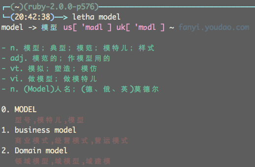

# letha

a lightweight command line directory

## Snapshot



## Usage

* add env variable in your ~/.*shrc file

```
export YOUDAO_KEYFROM="youdao-keyfrom"
export YOUDAO_KEY="youdao-key"
```

* just install it

```
./install.sh
```

* and just use it

```
letha xxx
```

## License

Copyright © 2015 jihui

Distributed under the Eclipse Public License, the same as Clojure.
